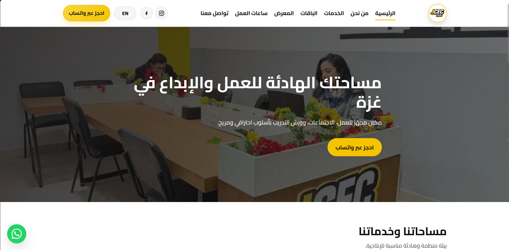
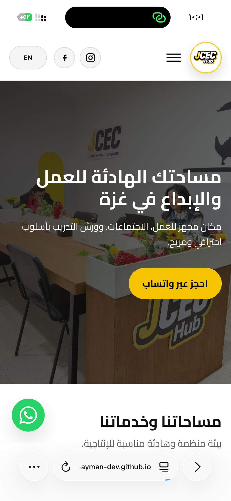

# JCEC Hub Website 🌐

A professional multi-page website built for a real client to establish a strong online presence and showcase services clearly.

## 🚀 Live Demo
👉 https://yousif-ayman-dev.github.io/jcec-hub/
💼 This project can be customized for businesses to create a strong online presence and attract more clients.
---

## 💡 Project Idea
This website was developed for a company in Gaza to help them:

- Present their services professionally
- Build trust with clients
- Improve their online visibility
- Make it easy for customers to contact them

---

## ✨ Key Features

- Fully responsive design (mobile, tablet, desktop)
- Arabic & English language support
- Clean and modern UI
- Fast loading performance
- WhatsApp quick contact integration
- Image gallery with lightbox
- SEO basics (meta tags, sitemap, robots.txt)

---

## 🛠️ Technologies Used

- HTML5
- CSS3
- JavaScript (Vanilla)

---

## 🎯 What I Focused On

- Translating business needs into a real website
- Clean and maintainable code
- User experience and simplicity
- Performance optimization

---

## 📸 Preview

  
  

---

## 👨‍💻 Developer

Developed by **Yousif Ayman**
Front-End Developer

---

## 💰 What I Can Do For You

- Build modern and responsive websites
- Create landing pages that convert visitors into clients
- Improve your business online presence
- Customize designs based on your needs

📩 Available for freelance work

---

## 📩 Contact Me

- Email: yousifaymand@gmail.com
- LinkedIn: LinkedIn: https://linkedin.com/in/yousif-ayman-a66379361
